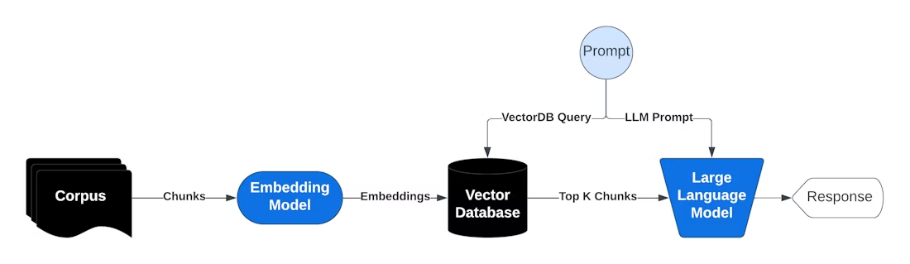

# Visual Architecture Diagram - Pathology Report Knowledge Extraction

## System Architecture - Complete Flow

```
╔═══════════════════════════════════════════════════════════════════════════════╗
║                     PATHOLOGY REPORT PROCESSING SYSTEM                        ║
║                    RAG + Spark NLP + Vector Database                          ║
╚═══════════════════════════════════════════════════════════════════════════════╝

┌───────────────────────────────────────────────────────────────────────────────┐
│                           1. DATA INGESTION                                   │
└───────────────────────────────────────────────────────────────────────────────┘

    📄 Pathology Reports (PDF)
         │
         ├─── Scanned PDFs ────────► OCR (Tesseract/EasyOCR)
         │                                     │
         └─── Digital PDFs ────────► PyMuPDF Text Extraction
                                               │
                                               ▼
                                      📝 Raw Text Files
                                               │
                                               │
┌──────────────────────────────────────────────┼─────────────────────────────────┐
│                    2. SPARK NLP PROCESSING   │                                 │
└──────────────────────────────────────────────┼─────────────────────────────────┘
                                               │
                    ┌──────────────────────────┴──────────────────────────┐
                    │        Spark NLP Medical Pipeline                   │
                    │                                                      │
                    │  ┌────────────────────────────────────────────┐    │
                    │  │  Stage 1: Document Assembly                │    │
                    │  │  • DocumentAssembler                       │    │
                    │  │  • SentenceDetector                        │    │
                    │  │  • Tokenizer                               │    │
                    │  └──────────────┬─────────────────────────────┘    │
                    │                 ▼                                   │
                    │  ┌────────────────────────────────────────────┐    │
                    │  │  Stage 2: Entity Recognition (NER)         │    │
                    │  │  • Medical NER (BioBERT/ClinicalBERT)     │    │
                    │  │  • Extract: PROBLEM, TREATMENT, TEST,      │    │
                    │  │            ANATOMY, LAB_VALUE              │    │
                    │  └──────────────┬─────────────────────────────┘    │
                    │                 ▼                                   │
                    │  ┌────────────────────────────────────────────┐    │
                    │  │  Stage 3: Assertion & Relations            │    │
                    │  │  • AssertionDL (present/absent/possible)   │    │
                    │  │  • RelationExtraction (entity links)       │    │
                    │  └──────────────┬─────────────────────────────┘    │
                    │                                                    │
                    └─────────────────┼─────────────────────────────────┘
                                      ▼
                          📊 Structured Clinical Data
                          {
                            "entities": [...],
                            "relations": [...],
                            "assertions": [...],
                            "metadata": {...}
                          }
                                      │
                                      │
┌─────────────────────────────────────┼───────────────────────────────────────┐
│                  3. CHUNKING & ENRICHMENT                                    │
└─────────────────────────────────────┼───────────────────────────────────────┘
                                      │
                    ┌─────────────────┴─────────────────┐
                    │                                   │
                    ▼                                   ▼
          ┌──────────────────┐              ┌──────────────────┐
          │ Section-Based    │              │ Semantic-Based   │
          │ Chunking         │              │ Chunking         │
          │                  │              │                  │
          │ • Clinical       │              │ • 512-1024       │
          │   History        │              │   tokens         │
          │ • Findings       │              │ • 128 overlap    │
          │ • Diagnosis      │              │ • Entity-aware   │
          │ • Treatment      │              │                  │
          └────────┬─────────┘              └────────┬─────────┘
                   │                                 │
                   └────────────┬────────────────────┘
                                │
                                ▼
                    📦 Enriched Chunks with Metadata
                    {
                      "chunk_id": "...",
                      "text": "...",
                      "entities": [...],
                      "section": "...",
                      "report_date": "...",
                      "report_type": "..."
                    }
                                │
                                │
┌───────────────────────────────┼───────────────────────────────────────────┐
│               4. EMBEDDING GENERATION                                      │
└───────────────────────────────┼───────────────────────────────────────────┘
                                │
                    ┌───────────┴───────────┐
                    │                       │
                    ▼                       ▼
         ┌────────────────────┐   ┌────────────────────┐
         │ Dense Embeddings   │   │ Sparse Embeddings  │
         │                    │   │                    │
         │ • BioBERT          │   │ • BM25             │
         │ • ClinicalBERT     │   │ • TF-IDF           │
         │ • PubMedBERT       │   │ • Keyword Index    │
         │ • SapBERT          │   │                    │
         │                    │   │                    │
         │ 768-dim vectors    │   │ Sparse vectors     │
         └────────┬───────────┘   └────────┬───────────┘
                  │                        │
                  └───────────┬────────────┘
                              │
                              ▼
                    🔢 Hybrid Embeddings
                              │
                              │
┌─────────────────────────────┼─────────────────────────────────────────────┐
│               5. VECTOR DATABASE STORAGE                                   │
└─────────────────────────────┼─────────────────────────────────────────────┘
                              │
              ┌───────────────┼───────────────┐
              │               │               │
              ▼               ▼               ▼
      ┌──────────────┐ ┌──────────────┐ ┌──────────────┐
      │  ChromaDB    │ │    FAISS     │ │  Pinecone    │
      │              │ │              │ │              │
      │ • Dev/Test   │ │ • Production │ │ • Cloud      │
      │ • Easy setup │ │ • Fast       │ │ • Managed    │
      │ • Metadata   │ │ • Scalable   │ │ • Enterprise │
      └──────┬───────┘ └──────┬───────┘ └──────┬───────┘
             │                │                │
             └────────────────┼────────────────┘
                              │
                              ▼
                  💾 Indexed Knowledge Base
                  • Embeddings: 384-768 dims
                  • Metadata: entities, dates, types
                  • Relations: entity graphs
                              │
                              │
┌─────────────────────────────┼─────────────────────────────────────────────┐
│                     6. QUERY & RETRIEVAL (RAG)                             │
└─────────────────────────────┼─────────────────────────────────────────────┘
                              │
         👤 User Query: "What are ER+ breast cancer markers?"
                              │
                              ▼
              ┌───────────────────────────────┐
              │   Query Processing            │
              │   • Entity extraction         │
              │   • Query expansion           │
              │   • Generate embeddings       │
              └───────────┬───────────────────┘
                          │
                          ▼
              ┌───────────────────────────────┐
              │   Hybrid Retrieval            │
              │                               │
              │   ┌─────────────────────┐    │
              │   │ Dense Search        │    │
              │   │ (Semantic)          │────┼──► Top 20 chunks
              │   └─────────────────────┘    │
              │                               │
              │   ┌─────────────────────┐    │
              │   │ Sparse Search       │    │
              │   │ (BM25/Keywords)     │────┼──► Top 20 chunks
              │   └─────────────────────┘    │
              │                               │
              │   ┌─────────────────────┐    │
              │   │ Entity Filter       │    │
              │   │ (Medical entities)  │────┼──► Filtered
              │   └─────────────────────┘    │
              └───────────┬───────────────────┘
                          │
                          ▼
              ┌───────────────────────────────┐
              │   Reranking                   │
              │   • Cross-encoder scoring     │
              │   • Medical relevance         │
              │   • Temporal filtering        │
              └───────────┬───────────────────┘
                          │
                          ▼
                  📚 Top 5-10 Relevant Chunks
                          │
                          │
┌─────────────────────────┼───────────────────────────────────────────────┐
│                 7. GENERATION (LLM)                                       │
└─────────────────────────┼───────────────────────────────────────────────┘
                          │
                          ▼
          ┌───────────────────────────────────┐
          │   Prompt Construction             │
          │                                   │
          │   System: "You are a medical      │
          │            expert assistant..."   │
          │                                   │
          │   Context: [Retrieved chunks]     │
          │                                   │
          │   Query: [User question]          │
          │                                   │
          │   Instructions: "Answer with      │
          │                  citations..."    │
          └───────────┬───────────────────────┘
                      │
                      ▼
          ┌───────────────────────────────────┐
          │   LLM (Claude/GPT-4/Med-PaLM)    │
          │                                   │
          │   • Medical reasoning             │
          │   • Citation generation           │
          │   • Accuracy validation           │
          └───────────┬───────────────────────┘
                      │
                      ▼
          ┌───────────────────────────────────┐
          │   Post-processing                 │
          │   • Format citations              │
          │   • Fact checking                 │
          │   • Safety validation             │
          └───────────┬───────────────────────┘
                      │
                      ▼
                  💬 Final Response
                      │
                      │
┌─────────────────────┼─────────────────────────────────────────────────┐
│             8. USER INTERFACE                                           │
└─────────────────────┼─────────────────────────────────────────────────┘
                      │
        ┌─────────────┼─────────────┐
        │             │             │
        ▼             ▼             ▼
   ┌────────┐   ┌─────────┐   ┌──────────┐
   │  CLI   │   │ Web UI  │   │ REST API │
   │        │   │         │   │          │
   │ Python │   │Streamlit│   │ FastAPI  │
   │ Script │   │ Gradio  │   │          │
   └────────┘   └─────────┘   └──────────┘
        │             │             │
        └─────────────┼─────────────┘
                      │
                      ▼
              📊 User Gets Answer
              with Citations & Sources


╔═══════════════════════════════════════════════════════════════════════════╗
║                        SUPPORTING COMPONENTS                              ║
╚═══════════════════════════════════════════════════════════════════════════╝

┌─────────────────────┐  ┌─────────────────────┐  ┌────────────────────────┐
│  Monitoring &       │  │  Knowledge Graph    │  │  Caching Layer         │
│  Logging            │  │  (Optional)         │  │                        │
│                     │  │                     │  │  • Query cache         │
│  • MLflow           │  │  • Neo4j            │  │  • Embedding cache     │
│  • W&B              │  │  • NetworkX         │  │  • LLM response cache  │
│  • Prometheus       │  │  • Entity graphs    │  │  • Redis/Memcached     │
└─────────────────────┘  └─────────────────────┘  └────────────────────────┘

┌─────────────────────┐  ┌─────────────────────┐  ┌────────────────────────┐
│  Security &         │  │  Evaluation         │  │  Data Pipeline         │
│  Compliance         │  │  Metrics            │  │                        │
│                     │  │                     │  │  • Apache Airflow      │
│  • De-identification│  │  • Precision@k      │  │  • Spark jobs          │
│  • HIPAA compliance │  │  • Medical accuracy │  │  • Batch processing    │
│  • Access control   │  │  • Latency          │  │  • ETL workflows       │
└─────────────────────┘  └─────────────────────┘  └────────────────────────┘

═══════════════════════════════════════════════════════════════════════════
                            END-TO-END FLOW
═══════════════════════════════════════════════════════════════════════════


